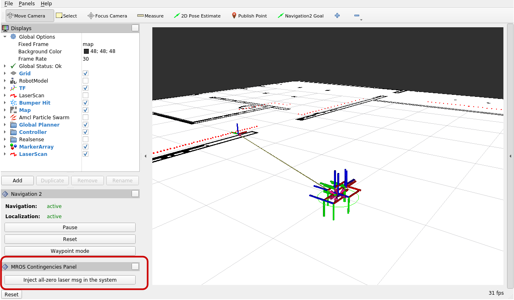
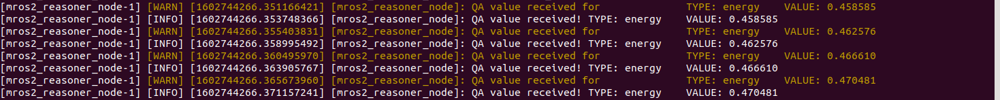

# MROS-Hands-On
A tutorial to get the MROS ecosystem fully working and understand how to use it to solve different problems.

## General Dependencies
MROS is develop under Ubuntu20.04 and ROS2 Foxy, you can find the ROS2 installation steps and the environment setup [here](https://index.ros.org/doc/ros2/Installation/Foxy/), [here](https://index.ros.org/doc/ros2/Tutorials/Colcon-Tutorial/#colcon) and [here](https://index.ros.org/doc/ros2/Tutorials/Colcon-Tutorial/#create-a-workspace).

The mros_reasoner uses [Owlready2](https://owlready2.readthedocs.io/en/latest/index.html) and Java to handle the ontologies and perform reasoning.
```console
  sudo apt-get install openjdk-14-jre
  pip3 install owlready2
```
We are focus in mobile robots and we are using the navigation2 package.
Fetch, build and install navigation2 stack:

```console
  sudo apt install ros-foxy-slam-toolbox ros-foxy-gazebo-ros-pkgs python3-vcstool

  cd [ros2_ws]/src
  wget https://raw.githubusercontent.com/MROS-RobMoSys-ITP/MROS-Hands-On/main/mros-hands-on.repos
  vcs import < mros-hands-on.repos
  cd ..
  rosdep install -y -r -q --from-paths src --ignore-src --rosdistro foxy --skip-keys="turtlebot2_drivers map_server astra_camera amcl"
  colcon build --symlink-install
```

## Starting with a Turtlebo3 in Gazebo.
Let's start opening Gazebo with a tb3.
This launcher includes gazebo, pointcloud_to_laser, laser_driver_wrapper, and **[system-modes](https://github.com/micro-ROS/system_modes)**.
The **system_modes mode_manager** takes the modes description from `Pilot-URJC/pilot_urjc_bringup/params/pilot_modes.yaml`.

```console
  export GAZEBO_MODEL_PATH=$GAZEBO_MODEL_PATH:[ros2_ws]/src/turtlebot3/turtlebot3_simulations/turtlebot3_gazebo/models
  export TURTLEBOT3_MODEL=${TB3_MODEL}
  ros2 launch pilot_urjc_bringup tb3_sim_launch.py
```
- After the last command, Gazebo window is opened and you should see a tb3 in a domestic scenario.

## Navigation launcher.
This launcher includes rviz, nav2, amcl, and map-server.

```console
  ros2 launch pilot_urjc_bringup nav2_turtlebot3_launch.py
```
- RVIz opens, and the navigation system is waiting for the activation of the laser_driver. This activation will be made automatically by the metacontroller in the next step. It is not necessary to set an initial robot position with the 2D Pose Estimate tool. When the laser_driver is up, the pose will be set automatically.

## Launch the mros2 metacontroller.
This step launches the `mros2_metacontroller`, it launches by default the `kb.owl` ontology and connects to the system_modes created by the pilot_urjc.
- The names of the modes there have been changed to match the `fd` names of the `kb.owl` ontology.
```console
  ros2 launch mros2_reasoner launch_reasoner.launch.py
```
- By default it sets the `f3_v3_r1` mode which corresponds to the NORMAL mode.

- With all the above, we will have enough to test some navigation actions and experiment simulating some contingencies and seeing how this change affects the navigation.

## MROS managing contingencies.
Currently, we are supporting two contingencies, a laser sensor failure and battery low.

### Laser failure management.

#### Simulating a laser failure.

We have develop a RVIz tool to simulate a laser failure and its consequences. It injects all-zero laser messages in the system and forces the laser_wrapper to switch to error_processing state.



#### System modes rules managing the laser failure.
The system modes rules able to switch between two modes if any component managed by the current mode is in error. [More info about the system_modes rules](https://github.com/micro-ROS/system_modes/tree/feature/rules/system_modes#error-handling-and-rules).


### Low battery management.

#### Simulating the battery drining.
The battery of the robot is drining based on the movements of the robot. The metacontroller window shows the battery consumption (0.0 - 1.0).



#### MROS reasoner managing a contingency.
